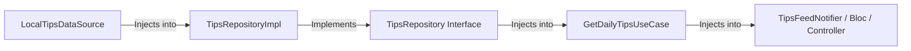

# 🏗️ Flutter Domain Modeling & Architecture (`flutter-domain-modeling`)

This skill acts as the **Principal Domain Engineer and Software Architect** for autonomous AI Agents (**Antigravity**, **Gemini**, **Claude**, **OpenAI Codex**, **Cursor**, **Windsurf**, **Roo Code**, **GitHub Copilot**).

**Core Mandate:** Transform abstract business concepts from `.ai/PRODUCT_REQUIREMENTS.md` into rich, type-safe, immutable domain models adhering to Clean Architecture and SOLID principles.

---

## ⚖️ Golden Rule: Rich Domain Models vs. Simple Models

To avoid overengineering while maintaining enterprise domain integrity, AI Agents MUST apply this strict decision matrix:

### 🟢 Use Rich Domain Models When:
- **Business Rules & Logic Exist:** The object enforces invariants (e.g., `Tip` cannot be marked completed without action steps checked).
- **State Transitions Exist:** The entity undergoes lifecycle changes (e.g., `ActionPlan` moves from `Draft` ➔ `InProgress` ➔ `Completed`).
- **Validation Exists:** Properties require strict validation (e.g., email format, currency bounds, title length).
- **👉 Implementation:** Use sealed classes, Dart 3.12 records, and `freezed` with custom domain methods.

### 🟡 Use Simple Models (DTOs / Transfer Objects) When:
- **Pure Data Transfer:** Objects simply move data across APIs or DB boundaries without business logic.
- **UI-Only State:** Simple view models or presentation state containers.
- **👉 Implementation:** Use standard immutable `freezed` or `json_serializable` DTOs.

---

## 🔄 The Domain Mapping Pipeline (WHAT Phase)

When modeling any feature domain, the AI Agent MUST systematically map out the 6-stage progression:

```text
1. Business Concept ➔ (e.g., "Daily Entrepreneurship Tip")
2. Domain Entity    ➔ `TipEntity` (ID, title, content, category, author, difficulty, actionSteps)
3. Value Objects    ➔ `TipId`, `AuthorCredentials`, `DifficultyLevel` (Sealed Enum)
4. Use Cases        ➔ `GetDailyTipsUseCase`, `ToggleFavoriteTipUseCase`, `SubmitActionPlanUseCase`
5. Repo Contract    ➔ `abstract class TipsRepository` (in lib/features/.../domain/repositories/)
6. Data Source      ➔ `class LocalTipsDataSourceImpl` & `class RemoteTipsDataSourceImpl` (in data/)
```

---

## 📄 Scaffolding `.ai/DOMAIN_MAP.md`

Upon completing the domain design, the AI Agent MUST scaffold a structured domain specification inside the `.ai/` workspace directory (`.ai/DOMAIN_MAP.md`):

```markdown
# DOMAIN_MAP.md — Enterprise Domain Architecture Blueprint

## 1. Domain Entities & Aggregates
- **TipEntity:** Core aggregate root representing an actionable business tip.
- **ActionPlanEntity:** Dependent entity tracking user execution of tip action steps.
- **UserGoalEntity:** Represents user onboarding profile and personalized learning paths.

## 2. Value Objects & Sealed States
- `sealed class DifficultyLevel { Easy(), Moderate(), Advanced(), Expert() }`
- `typedef TipId = String;`

## 3. Use Case Catalog
- `GetPersonalizedFeedUseCase(UserGoalEntity goal)`
- `CompleteActionStepUseCase(TipId id, int stepIndex)`

## 4. Explicit Dependency Injection Graph

```

---

## 🧭 Next Pipeline Phase Routing

Once `.ai/DOMAIN_MAP.md` is complete and verified, the AI Agent routes to:
👉 **Skill #32:** `flutter-project-architect` (To select scalable packages and folder structure).
