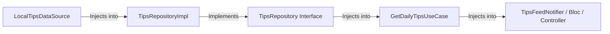

# 🏗️ Flutter Domain Modeling & Architecture (`flutter-domain-modeling`)

This skill acts as the **Principal Domain Engineer and Software Architect** for autonomous AI Agents (**Antigravity**, **Gemini**, **Claude**, **OpenAI Codex**, **Cursor**, **Windsurf**, **Roo Code**, **GitHub Copilot**).

**Core Mandate:** Transform abstract business concepts from `.agents/context/PRODUCT_REQUIREMENTS.md` into rich, type-safe, immutable domain models adhering to Clean Architecture and SOLID principles.

---

## ⚖️ Golden Rule: Rich Domain Models vs. Simple Models

To avoid overengineering while maintaining enterprise domain integrity, AI Agents MUST apply this strict decision matrix:

### 🟢 Use Rich Domain Models When:
- **Business Rules & Logic Exist:** The object enforces invariants (e.g., `Tip` cannot be marked completed without action steps checked).
- **State Transitions Exist:** The entity undergoes lifecycle changes (e.g., `ActionPlan` moves from `Draft` ➔ `InProgress` ➔ `Completed`).
- **Validation Exists:** Properties require strict validation (e.g., email format, currency bounds, title length).
- **👉 Implementation:** Use sealed classes, Dart 3.12 records, and `freezed` with custom domain methods.

### 🟡 Use Simple Models (DTOs / Transfer Objects) When:
- **Pure Data Transfer:** Objects simply move data across APIs or DB boundaries without business logic.
- **UI-Only State:** Simple view models or presentation state containers.
- **👉 Implementation:** Use standard immutable `freezed` or `json_serializable` DTOs.

---

## 🔄 The Domain Mapping Pipeline (WHAT Phase)

When modeling any feature domain, the AI Agent MUST systematically map out the 6-stage progression:

```text
1. Business Concept ➔ (e.g., "Daily Entrepreneurship Tip")
2. Domain Entity    ➔ `TipEntity` (ID, title, content, category, author, difficulty, actionSteps)
3. Value Objects    ➔ `TipId`, `AuthorCredentials`, `DifficultyLevel` (Sealed Enum)
4. Use Cases        ➔ `GetDailyTipsUseCase`, `ToggleFavoriteTipUseCase`, `SubmitActionPlanUseCase`
5. Repo Contract    ➔ `abstract class TipsRepository` (in lib/features/.../domain/repositories/)
6. Data Source      ➔ `class LocalTipsDataSourceImpl` & `class RemoteTipsDataSourceImpl` (in data/)
```

---

## 📄 Scaffolding `.agents/context/DOMAIN_MAP.md`

Upon completing the domain design, the AI Agent MUST scaffold a structured domain specification inside the `.agents/context/` workspace directory (`.agents/context/DOMAIN_MAP.md`):

```markdown
# DOMAIN_MAP.md — Enterprise Domain Architecture Blueprint

## 1. Domain Entities & Aggregates
- **TipEntity:** Core aggregate root representing an actionable business tip.
- **ActionPlanEntity:** Dependent entity tracking user execution of tip action steps.
- **UserGoalEntity:** Represents user onboarding profile and personalized learning paths.

## 2. Value Objects & Sealed States
- `sealed class DifficultyLevel { Easy(), Moderate(), Advanced(), Expert() }`
- `typedef TipId = String;`

## 3. Use Case Catalog
- `GetPersonalizedFeedUseCase(UserGoalEntity goal)`
- `CompleteActionStepUseCase(TipId id, int stepIndex)`

## 4. Explicit Dependency Injection Graph

```

---

## 🚫 Anti-Patterns

| Anti-Pattern | Why It's Harmful |
|---|---|
| Adding `@JsonSerializable` to Domain Entities | Couples business logic to API contracts; breaks layer isolation |
| Using DTOs directly in Use Cases | Exposes infrastructure concerns into the business layer |
| One giant Repository for everything | Violates SRP; creates untestable god-objects |
| Primitive types instead of Value Objects | Allows invalid states at runtime (e.g., negative prices, empty IDs) |
| Mutable Domain Entities | Makes state tracking unpredictable and testing unreliable |
| Designing Use Cases that call multiple Repositories | Creates hidden coupling between features; violates DDD aggregates |
| Skipping the Domain Mapping Pipeline | Results in anemic domain models with business logic leaking into controllers |

---

## ✅ Checklist

- [ ] Business concepts from `.agents/context/PRODUCT_REQUIREMENTS.md` mapped through all 6 Pipeline stages
- [ ] All Domain Entities are immutable (all fields `final`), pure Dart, no framework imports
- [ ] Value Objects created for all primitive-obsession candidates (IDs, currencies, enums)
- [ ] Sealed failure classes defined with `userMessage` property for UI consumption
- [ ] One abstract Repository interface per aggregate root (in `domain/repositories/`)
- [ ] One Use Case class per business action (single `call()` or `execute()` method)
- [ ] Dependency Injection graph documented (Data Source → Repo → UseCase → Notifier/Bloc)
- [ ] `.agents/context/DOMAIN_MAP.md` scaffolded with entities, value objects, use cases, and DI graph
- [ ] `dart run .agents/tools/verify_architecture.dart` passes with zero domain boundary violations

---

## 🧭 Next Pipeline Phase Routing

Once `.agents/context/DOMAIN_MAP.md` is complete and verified, the AI Agent routes to:
👉 **`flutter-project-architect`** (To select scalable packages and define folder structure for the implementation phase).

---

## Related Skills

- `flutter-product-discovery-and-architecture` — PRD discovery (WHY phase, precedes this skill)
- `flutter-project-architect` — Package selection and folder structure (follows this skill)
- `flutter-clean-architecture` — Layer boundaries and dependency rules
- `flutter-repository-pattern` — Repository interface and implementation patterns
- `flutter-error-handling` — Sealed failure class hierarchy design
- `flutter-create-feature` — End-to-end feature implementation workflow

## Validation

Before completing, verify the output against the target project's applicable analysis, test, and platform checks. Confirm that the result satisfies this skill's scope, preserves existing project conventions, and records any material assumption or limitation.
