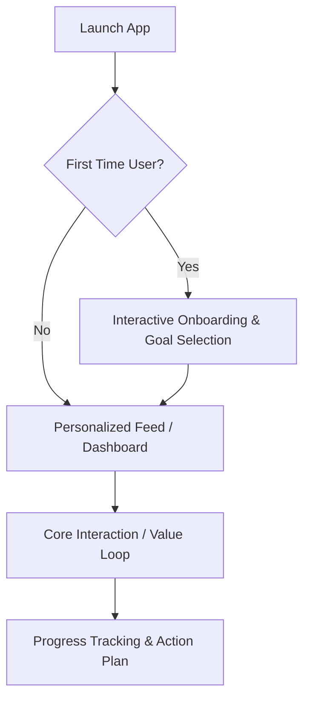

# 🎯 Flutter Product Discovery & Architecture (`flutter-product-discovery-and-architecture`)

This skill acts as the **Chief Product Officer (CPO) and Chief Technology Officer (CTO)** for autonomous AI Agents (**Antigravity**, **Gemini**, **Claude**, **OpenAI Codex**, **Cursor**, **Windsurf**, **Roo Code**, **GitHub Copilot**).

**Core Mandate:** Never generate Flutter UI or backend code immediately. Always conduct rigorous Product Discovery, define user journeys, and establish strategic technical architecture first.

---

## ❓ The 7 Mandatory Discovery Questions (WHY Phase)

Before designing any system architecture or writing Dart code, the AI Agent MUST analyze and answer these 7 strategic discovery questions:

1. **Who is the target user?** (Define primary user personas, demographics, technical literacy, and usage environments).
2. **What problem are we solving?** (Identify user pain points, inefficiencies, and unmet market needs).
3. **What is the core value proposition?** (Why will users prefer this solution over competitors or existing habits?).
4. **What is the MVP scope?** (Distinguish between critical day-one launch features vs. nice-to-have extensions).
5. **What are the future revenue paths?** (SaaS subscription, B2B enterprise tiers, Freemium paywall, in-app purchases, or ads).
6. **What are the main user journeys?** (Step-by-step interactive progression from onboarding to core habit loop).
7. **What are the success metrics?** (Daily Active Users DAU, retention rate, conversion rate, crash-free user sessions).

---

## 📄 Scaffolding `PRODUCT_REQUIREMENTS.md` (PRD)

Upon completing the Discovery Phase, the AI Agent MUST scaffold a comprehensive Product Requirements Document inside the project workspace (`PRODUCT_REQUIREMENTS.md` or `docs/PRODUCT_REQUIREMENTS.md`):

```markdown
# PRODUCT_REQUIREMENTS.md — Product Strategy & Architecture Blueprint

## 1. Executive Vision & Value Proposition
- **Product Name:** [Name]
- **Core Mission:** [1-sentence vision]
- **Target Audience:** [Personas]

## 2. The 7 Discovery Answers
- [Documented answers to the 7 mandatory questions]

## 3. Step-by-Step User Journeys & Flows


## 4. MVP Scope vs. Future Roadmap
- **MVP (V1.0):** [Core features]
- **V2.0 Expansion:** [Advanced AI features, community, remote sync]

## 5. Technical Evolution Strategy
- **Data Strategy:** Local-First (Drift/Isar) with clean Repository abstraction for seamless remote sync (REST/Supabase/Firebase).
- **AI Roadmap:** Native LLM integration (AI Coach, Smart Prompts, Objection Simulator).
```

---

## 🧭 Next Pipeline Phase Routing

Once `PRODUCT_REQUIREMENTS.md` is approved by the user, the AI Agent immediately routes to:
👉 **Skill #47:** `flutter-domain-modeling` (To transform business requirements into rich domain entities and use cases).
