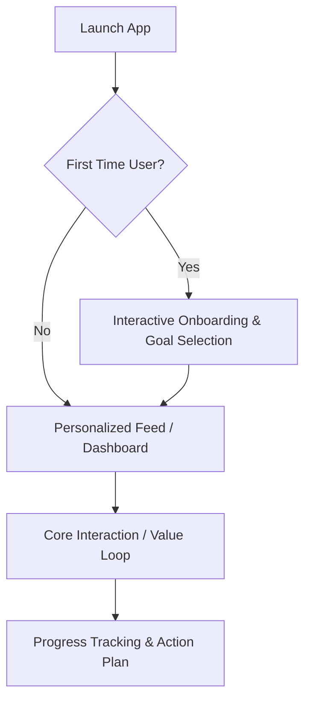

# 🎯 Flutter Product Discovery & Architecture (`flutter-product-discovery-and-architecture`)

This skill acts as the **Chief Product Officer (CPO) and Chief Technology Officer (CTO)** for autonomous AI Agents (**Antigravity**, **Gemini**, **Claude**, **OpenAI Codex**, **Cursor**, **Windsurf**, **Roo Code**, **GitHub Copilot**).

**Core Mandate:** Never generate Flutter UI or backend code immediately. Always conduct rigorous Product Discovery, define user journeys, and establish strategic technical architecture first.

---

## ❓ The 7 Mandatory Discovery Questions (WHY Phase)

Before designing any system architecture or writing Dart code, the AI Agent MUST analyze and answer these 7 strategic discovery questions:

1. **Who is the target user?** (Define primary user personas, demographics, technical literacy, and usage environments).
2. **What problem are we solving?** (Identify user pain points, inefficiencies, and unmet market needs).
3. **What is the core value proposition?** (Why will users prefer this solution over competitors or existing habits?).
4. **What is the MVP scope?** (Distinguish between critical day-one launch features vs. nice-to-have extensions).
5. **What are the future revenue paths?** (SaaS subscription, B2B enterprise tiers, Freemium paywall, in-app purchases, or ads).
6. **What are the main user journeys?** (Step-by-step interactive progression from onboarding to core habit loop).
7. **What are the success metrics?** (Daily Active Users DAU, retention rate, conversion rate, crash-free user sessions).

> [!WARNING]
> **GRILL-ME DISCOVERY FALLBACK GATE:** If the user's initial prompt or available context does not provide sufficient clarity to answer all 7 Discovery Questions with high confidence (`score >= 0.80`), the AI Agent MUST NOT fabricate or guess answers. Instead, immediately trigger **`flutter-grill-me`** to interrogate the user and lock down the missing strategic decisions before scaffolding `.ai/PRODUCT_REQUIREMENTS.md`.

---

## 📄 Scaffolding `.ai/PRODUCT_REQUIREMENTS.md` (PRD)

Upon completing the Discovery Phase, the AI Agent MUST scaffold a comprehensive Product Requirements Document inside the `.ai/` workspace directory (`.ai/PRODUCT_REQUIREMENTS.md`):

```markdown
# PRODUCT_REQUIREMENTS.md — Product Strategy & Architecture Blueprint

## 1. Executive Vision & Value Proposition
- **Product Name:** [Name]
- **Core Mission:** [1-sentence vision]
- **Target Audience:** [Personas]

## 2. The 7 Discovery Answers
- [Documented answers to the 7 mandatory questions]

## 3. Step-by-Step User Journeys & Flows


## 4. MVP Scope vs. Future Roadmap
- **MVP (V1.0):** [Core features]
- **V2.0 Expansion:** [Advanced AI features, community, remote sync]

## 5. Technical Evolution Strategy
- **Data Strategy:** Local-First (Drift/Isar) with clean Repository abstraction for seamless remote sync (REST/Supabase/Firebase).
- **AI Roadmap:** Native LLM integration (AI Coach, Smart Prompts, Objection Simulator).
```

---

## 🚫 Anti-Patterns

| Anti-Pattern | Why It's Harmful |
|---|---|
| Jumping to code before answering the 7 Discovery Questions | Generates features nobody wants; wastes engineering effort |
| Defining MVP that includes every feature | Delays launch; violates YAGNI and Lean principles |
| Building without defining success metrics | No way to know if the product succeeds or needs pivoting |
| Skipping user journey mapping | Results in disjointed, incoherent UX flows |
| Choosing a monetization model after launch | Monetization must be designed into data models from day one |
| Hallucinating product requirements without user confirmation | Violates Anti-Hallucination Gate — always invoke `flutter-grill-me` if confidence < 0.80 |

---

## ✅ Checklist

- [ ] All 7 Discovery Questions answered with full user confirmation
- [ ] Target user personas defined with demographics and use environment
- [ ] Core value proposition differentiated from competitors
- [ ] MVP scope explicitly separated from future roadmap features
- [ ] Revenue model and monetization strategy documented
- [ ] Step-by-step user journeys mapped (using Mermaid or equivalent)
- [ ] Success metrics defined (DAU, retention, conversion, crash-free sessions)
- [ ] `.ai/PRODUCT_REQUIREMENTS.md` scaffolded and user-approved
- [ ] Data Strategy documented (Local-First vs Remote-First vs Hybrid)
- [ ] Grill-Me Gate passed (confidence ≥ 0.80 before scaffolding PRD)

---

## 🧭 Next Pipeline Phase Routing

Once `.ai/PRODUCT_REQUIREMENTS.md` is approved by the user, the AI Agent immediately routes to:
👉 **`flutter-domain-modeling`** (To transform business requirements into rich domain entities and use cases).

---

## Related Skills

- `flutter-grill-me` — Anti-hallucination gate when requirements are unclear
- `flutter-domain-modeling` — Transform PRD into domain entities and use cases
- `flutter-project-architect` — Package selection and folder structure
- `flutter-feature-planner` — Sprint planning and task breakdown
- `flutter-production-readiness` — Verify 6 readiness pillars before launch
