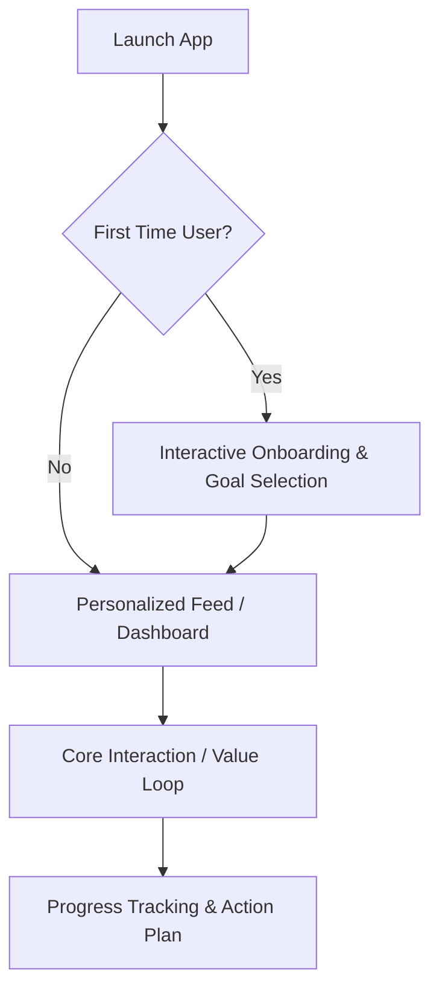

# 🎯 Flutter Product Discovery & Architecture (`flutter-product-discovery-and-architecture`)

This skill acts as the **Chief Product Officer (CPO) and Chief Technology Officer (CTO)** for autonomous AI Agents (**Antigravity**, **Gemini**, **Claude**, **OpenAI Codex**, **Cursor**, **Windsurf**, **Roo Code**, **GitHub Copilot**).

**Core mandate:** Use product discovery for a new product, a materially ambiguous feature, or an explicit strategy request. Do not impose full discovery on a small maintenance task; recover only the context and decisions necessary for the work.

---

## ❓ The 7 Mandatory Discovery Questions (WHY Phase)

Before designing any system architecture or writing Dart code, the AI Agent MUST analyze and answer these 7 strategic discovery questions:

1. **Who is the target user?** (Define primary user personas, demographics, technical literacy, and usage environments).
2. **What problem are we solving?** (Identify user pain points, inefficiencies, and unmet market needs).
3. **What is the core value proposition?** (Why will users prefer this solution over competitors or existing habits?).
4. **What is the MVP scope?** (Distinguish between critical day-one launch features vs. nice-to-have extensions).
5. **What are the future revenue paths?** (SaaS subscription, B2B enterprise tiers, Freemium paywall, in-app purchases, or ads).
6. **What are the main user journeys?** (Step-by-step interactive progression from onboarding to core habit loop).
7. **What are the success metrics?** (Daily Active Users DAU, retention rate, conversion rate, crash-free user sessions).

> **Discovery decision rule:** If a missing answer would change the product scope, architecture, data, security, launch plan, or user-visible behavior, use **`flutter-grill-me`** to obtain an answer or record an explicit assumption before creating the relevant section of `.agents/context/PRODUCT_REQUIREMENTS.md`. Do not fabricate product requirements or require unrelated discovery answers for a narrowly scoped task.

---

## 📄 Scaffolding `.agents/context/PRODUCT_REQUIREMENTS.md` (PRD)

Upon completing the Discovery Phase, the AI Agent MUST scaffold a comprehensive Product Requirements Document inside the `.agents/context/` workspace directory (`.agents/context/PRODUCT_REQUIREMENTS.md`):

```markdown
# PRODUCT_REQUIREMENTS.md — Product Strategy & Architecture Blueprint

## 1. Executive Vision & Value Proposition
- **Product Name:** [Name]
- **Core Mission:** [1-sentence vision]
- **Target Audience:** [Personas]

## 2. The 7 Discovery Answers
- [Documented answers to the 7 mandatory questions]

## 3. Step-by-Step User Journeys & Flows


## 4. MVP Scope vs. Future Roadmap
- **MVP (V1.0):** [Core features]
- **V2.0 Expansion:** [Advanced AI features, community, remote sync]

## 5. Technical Evolution Strategy
- **Data Strategy:** Local-First (Drift/Isar) with clean Repository abstraction for seamless remote sync (REST/Supabase/Firebase).
- **AI Roadmap:** Native LLM integration (AI Coach, Smart Prompts, Objection Simulator).
```

---

## 🚫 Anti-Patterns

| Anti-Pattern | Why It's Harmful |
|---|---|
| Jumping to code before answering the 7 Discovery Questions | Generates features nobody wants; wastes engineering effort |
| Defining MVP that includes every feature | Delays launch; violates YAGNI and Lean principles |
| Building without defining success metrics | No way to know if the product succeeds or needs pivoting |
| Skipping user journey mapping | Results in disjointed, incoherent UX flows |
| Choosing a monetization model after launch | Monetization must be designed into data models from day one |
| Hallucinating product requirements without user confirmation | Creates unsupported product decisions; use `flutter-grill-me` when a missing answer is material. |

---

## ✅ Checklist

- [ ] All discovery questions relevant to the product or feature have explicit answers or documented assumptions
- [ ] Target user personas defined with demographics and use environment
- [ ] Core value proposition differentiated from competitors
- [ ] MVP scope explicitly separated from future roadmap features
- [ ] Revenue model and monetization strategy documented
- [ ] Step-by-step user journeys mapped (using Mermaid or equivalent)
- [ ] Success metrics defined (DAU, retention, conversion, crash-free sessions)
- [ ] `.agents/context/PRODUCT_REQUIREMENTS.md` scaffolded and user-approved
- [ ] Data Strategy documented (Local-First vs Remote-First vs Hybrid)
- [ ] Material unknowns were resolved through `flutter-grill-me` or recorded as explicit assumptions before PRD scaffolding

---

## 🧭 Next Pipeline Phase Routing

Once `.agents/context/PRODUCT_REQUIREMENTS.md` is approved by the user, the AI Agent immediately routes to:
👉 **`flutter-domain-modeling`** (To transform business requirements into rich domain entities and use cases).

---

## Related Skills

- `flutter-grill-me` — Anti-hallucination gate when requirements are unclear
- `flutter-domain-modeling` — Transform PRD into domain entities and use cases
- `flutter-project-architect` — Package selection and folder structure
- `flutter-feature-planner` — Sprint planning and task breakdown
- `flutter-production-readiness` — Verify 6 readiness pillars before launch

## Validation

Before completing, verify the output against the target project's applicable analysis, test, and platform checks. Confirm that the result satisfies this skill's scope, preserves existing project conventions, and records any material assumption or limitation.
