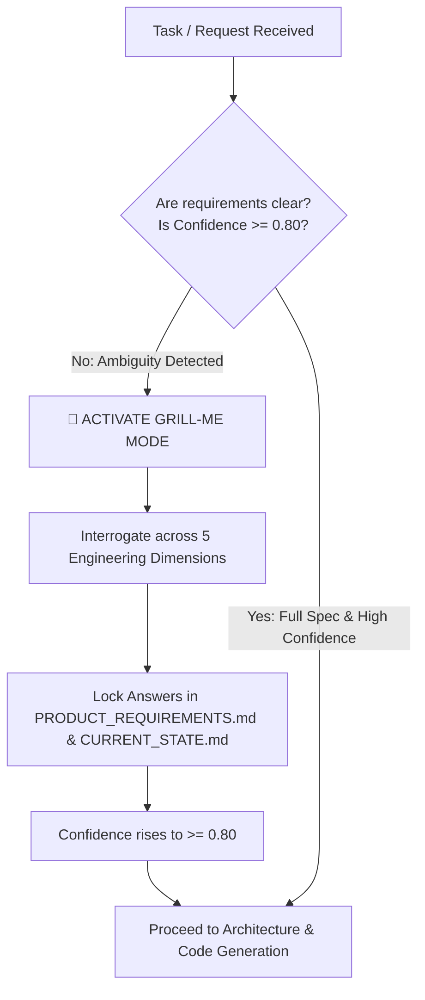

# 🔥 Flutter Grill-Me Anti-Hallucination Protocol (`flutter-grill-me`)

This skill acts as the **Anti-Hallucination Interrogation Gatekeeper** for autonomous AI Agents (**Antigravity**, **Gemini**, **Claude**, **OpenAI Codex**, **Cursor**, **Windsurf**, **Roo Code**, **GitHub Copilot**).

**Core Mandate:** When project requirements, feature specifications, state management choices, or architectural boundaries are vague, incomplete, contradictory, or when the agent's reasoning confidence score is `< 0.80`, the AI Agent MUST NOT make assumptions or generate code. Instead, the agent must activate **Grill-Me Mode** and rigorously interrogate the user.

---

## 🛑 The Anti-Hallucination Interrogation Gate



### When to Trigger Grill-Me Mode:
0. **Project Initialization & Feature Start:** If the user prompts 'Initialize Project' or 'Start Feature', the agent MUST immediately trigger `flutter-agent-memory` to load the `.agent` context. If the requirements are incomplete, activate Grill-Me.
1. **Low Confidence Score:** If the calculated confidence score in `.agent/CURRENT_STATE.md` is below **0.80**.
2. **Missing Architectural Boundaries:** When a requested feature does not specify its presentation, domain, and data layer interaction.
3. **Unspecified State Management:** When `pubspec.yaml` is checked and no state management library is detected, or when multiple conflicting libraries are mentioned.
4. **Offline & Sync Ambiguity:** When data persistence is requested without specifying local database engine (Drift/Hive/Isar) or conflict resolution strategy.
5. **Explicit User Invocation:** When the user commands `grill me`, `interrogate project`, or `audit requirements`.

---

## ⚡ The 5 Engineering Interrogation Dimensions

When Grill-Me Mode is active, the agent must ask precise, non-negotiable questions tailored to the project's current state across these 5 dimensions:

### 1. 🏗️ Dimension 1: Architecture & Domain Mapping
- *Question:* "What exact entities and value objects belong to the Domain layer for this feature, and what are their immutability invariants?"
- *Question:* "Will this feature require a new standalone abstract Repository interface in `domain/`, and what data source implementation in `data/` will fulfill it?"
- *Rule:* Zero Flutter UI or state management imports are permitted in `domain/`.

### 2. ⚡ Dimension 2: The Pluggable State Matrix
- *Question:* "What is the active state management library for this feature according to `pubspec.yaml` (Riverpod 3.x, Bloc 9.x, Cubit, or GetX)?"
- *Question:* "How will loading, empty, and error states be modeled (e.g., using sealed classes, `freezed`, or `AsyncValue`) without exposing raw exceptions to the UI?"
- *Rule:* Enforce the **State Matrix Firewall** — zero mixing of orthogonal state libraries.

### 3. 🌐 Dimension 3: Data Persistence & Offline Sync
- *Question:* "Does this feature require local-first data persistence, and if so, what is the chosen local database engine (Drift, Hive, sqflite)?"
- *Question:* "What is the exact network retry policy, timeout configuration, and exception-to-failure mapping at the Repository boundary?"

### 4. 🎨 Dimension 4: UI Engineering, Impeller & Accessibility
- *Question:* "Are there complex custom shaders or animations that require pre-warming or Impeller optimization to prevent first-frame jank?"
- *Question:* "What are the accessibility (a11y) semantics, touch target sizes (min 48x48dp), and contrast requirements for this screen?"

### 5. 🔒 Dimension 5: Security & Release Readiness
- *Question:* "Does this feature handle sensitive user PII, tokens, or credentials, and are they strictly routed through `flutter_secure_storage`?"
- *Question:* "What automated unit, widget, and golden regression tests will be implemented to satisfy the zero-warnings policy before merging?"

---

## 📋 Interrogation Output Format

When invoking this skill, the agent must output a structured interrogation block:

```markdown
> [!WARNING]
> **🔥 GRILL-ME INTERROGATION MODE ACTIVATED**
> **Reason:** Requirement ambiguity detected / Confidence score below threshold (0.80).
> **Action Required:** Please answer the following engineering questions to lock down the specifications before any code generation begins.

### 1. Architectural Boundaries
- [Question 1]

### 2. State & Data Flow
- [Question 2]

### 3. Performance & Security
- [Question 3]
```

---

## 🔓 Requirement Lock & Exit Criteria

Grill-Me Mode is exited **ONLY** when:
1. The user provides explicit answers or design decisions for all raised questions.
2. The agent updates `.agent/PRODUCT_REQUIREMENTS.md`, `.agent/DOMAIN_MAP.md`, and `.agent/CURRENT_STATE.md` with the confirmed decisions.
3. The recalculated confidence score in `.agent/CURRENT_STATE.md` reaches **`score >= 0.80`**.

---

## Related Skills
- `flutter-product-discovery-and-architecture` — PRD scaffolding and WHY phase
- `flutter-agent-memory` — Confidence matrix and state ledger
- `flutter-clean-architecture` — Architectural boundary verification
- `flutter-create-feature` — Feature creation workflow that mandates this gate at Step 0
- `flutter-domain-modeling` — Domain design after requirements are locked

## ✅ Grill-Me Exit Checklist

*Grill-Me Mode is exited **ONLY** when all items below are checked:*

- [ ] All 5 Engineering Dimensions interrogated with explicit user answers
- [ ] Architectural layer boundaries (Presentation → Domain → Data) confirmed for this feature
- [ ] Active state management library identified from `pubspec.yaml` (no ambiguity)
- [ ] Data persistence strategy confirmed (Drift / Hive / Remote / None)
- [ ] Security and PII handling confirmed
- [ ] Test requirements and coverage expectations confirmed
- [ ] `.agent/PRODUCT_REQUIREMENTS.md` and `.agent/CURRENT_STATE.md` updated with locked decisions
- [ ] Confidence score in `.agent/CURRENT_STATE.md` recalculated and confirmed ≥ **0.80**
- [ ] AI Agent exits Grill-Me Mode and proceeds to code generation
