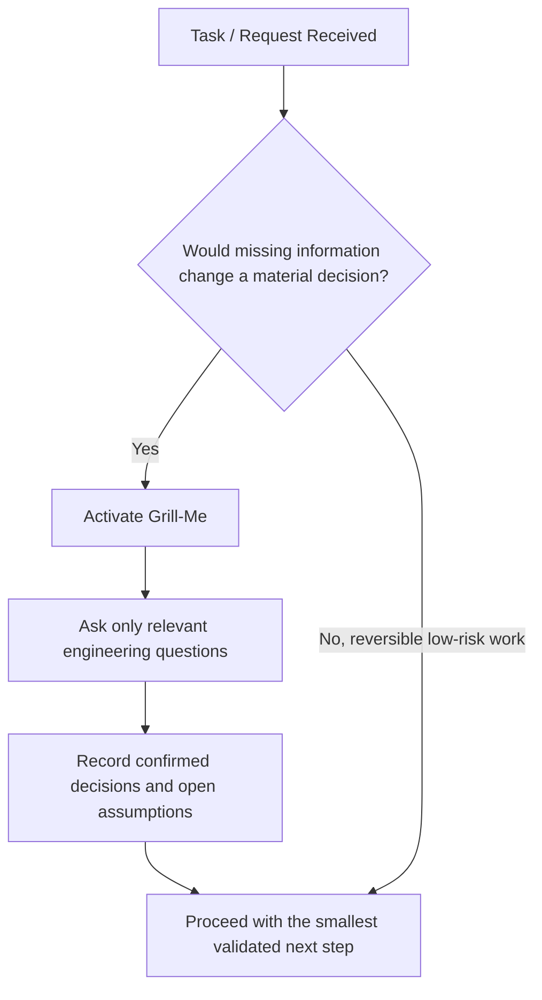

# 🔥 Flutter Grill-Me Anti-Hallucination Protocol (`flutter-grill-me`)

This skill acts as the **Anti-Hallucination Interrogation Gatekeeper** for autonomous AI Agents (**Antigravity**, **Gemini**, **Claude**, **OpenAI Codex**, **Cursor**, **Windsurf**, **Roo Code**, **GitHub Copilot**).

**Core mandate:** Activate this workflow when missing or conflicting information could materially change architecture, state management, data, security, deployment, or user-visible behavior. Ask only the questions relevant to that decision. For a reversible low-risk change, state the assumption, make the smallest safe change, and validate it instead of forcing a full interrogation.

---

## 🛑 The Anti-Hallucination Interrogation Gate



### When to Trigger Grill-Me Mode:
0. **Project initialization or feature start:** Read relevant `.agents/context/` state if it exists. Activate Grill-Me only when the new work has material unresolved requirements.
1. **Material uncertainty:** The missing information could change architecture, security, data handling, dependency selection, external contracts, deployment, or visible behavior.
2. **Missing architectural boundaries:** A requested non-trivial feature does not specify the required presentation, domain, and data interactions.
3. **Unspecified state management:** The relevant feature has no established approach and the choice would shape new code, or a requested change conflicts with its existing approach.
4. **Offline and synchronization ambiguity:** Persistence or synchronization is requested without a conflict-resolution, ownership, or data-retention decision.
5. **Explicit user invocation:** The user commands `grill me`, `interrogate project`, or `audit requirements`.

---

## ⚡ The 5 Engineering Interrogation Dimensions

When Grill-Me Mode is active, the agent must ask precise, non-negotiable questions tailored to the project's current state across these 5 dimensions:

### 1. 🏗️ Dimension 1: Architecture & Domain Mapping
- *Question:* "What exact entities and value objects belong to the Domain layer for this feature, and what are their immutability invariants?"
- *Question:* "Will this feature require a new standalone abstract Repository interface in `domain/`, and what data source implementation in `data/` will fulfill it?"
- *Rule:* Zero Flutter UI or state management imports are permitted in `domain/`.

### 2. ⚡ Dimension 2: The Pluggable State Matrix
- *Question:* "What is the active state management library for this feature according to `pubspec.yaml` (Riverpod 3.x, Bloc 9.x, Cubit, or GetX)?"
- *Question:* "How will loading, empty, and error states be modeled (e.g., using sealed classes, `freezed`, or `AsyncValue`) without exposing raw exceptions to the UI?"
- *Rule:* Reuse the state-management approach already used by the affected feature. Do not mix approaches in one feature without an explicit migration boundary and removal plan.

### 3. 🌐 Dimension 3: Data Persistence & Offline Sync
- *Question:* "Does this feature require local-first data persistence, and if so, what is the chosen local database engine (Drift, Hive, sqflite)?"
- *Question:* "What is the exact network retry policy, timeout configuration, and exception-to-failure mapping at the Repository boundary?"

### 4. 🎨 Dimension 4: UI Engineering, Impeller & Accessibility
- *Question:* "Are there complex custom shaders or animations that require pre-warming or Impeller optimization to prevent first-frame jank?"
- *Question:* "What are the accessibility (a11y) semantics, touch target sizes (min 48x48dp), and contrast requirements for this screen?"

### 5. 🔒 Dimension 5: Security & Release Readiness
- *Question:* "Does this feature handle sensitive user PII, tokens, or credentials, and are they strictly routed through `flutter_secure_storage`?"
- *Question:* "What automated unit, widget, and golden regression tests will be implemented to satisfy the zero-warnings policy before merging?"

---

## 📋 Interrogation Output Format

When invoking this skill, the agent must output a structured interrogation block:

```markdown
> [!WARNING]
> **🔥 GRILL-ME INTERROGATION MODE ACTIVATED**
> **Reason:** Missing or conflicting information could change a material engineering decision.
> **Action Required:** Please answer the following engineering questions to lock down the specifications before any code generation begins.

### 1. Architectural Boundaries
- [Question 1]

### 2. State & Data Flow
- [Question 2]

### 3. Performance & Security
- [Question 3]
```

---

## 🔓 Requirement Lock & Exit Criteria

Exit Grill-Me Mode when the relevant questions have explicit answers or documented assumptions, the resulting decision is recorded in the applicable project-state or design artifact, and the next implementation step has an appropriate validation plan. Do not require unrelated dimensions, files, or a numerical confidence score.

---

## Related Skills
- `flutter-product-discovery-and-architecture` — PRD scaffolding and WHY phase
- `flutter-agent-memory` — Context, handoff, and state ledger
- `flutter-clean-architecture` — Architectural boundary verification
- `flutter-create-feature` — Feature creation workflow that mandates this gate at Step 0
- `flutter-domain-modeling` — Domain design after requirements are locked

## ✅ Grill-Me Exit Checklist

*Exit Grill-Me Mode only after the relevant items below are checked:*

- [ ] The material uncertainty is explicitly identified.
- [ ] Relevant engineering dimensions have explicit user answers or documented assumptions.
- [ ] Architecture, state, data, security, and test decisions are recorded when applicable.
- [ ] Affected project-state or design artifacts are updated when persistent tracking is enabled.
- [ ] The next action is scoped, reversible where practical, and has a validation plan.

## Validation

Before completing, verify the output against the target project's applicable analysis, test, and platform checks. Confirm that the result satisfies this skill's scope, preserves existing project conventions, and records any material assumption or limitation.
